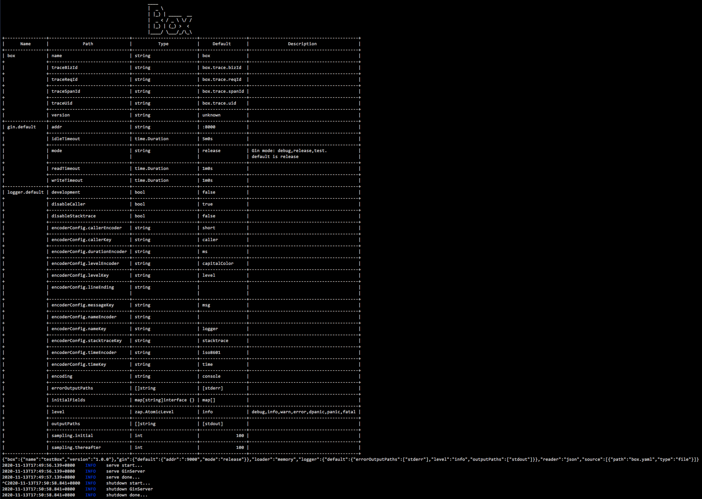

							____
							|  _ \
							| |_) | _____  __
							|  _ < / _ \ \/ /
							| |_) | (_) >  <
							|____/ \___/_/\_\

[English](README_en.md) | 简体中文

[](https://pkg.go.dev/github.com/boxgo/box)
[](https://goreportcard.com/report/github.com/boxgo/box)
[](https://github.com/boxgo/box/actions)
[](https://coveralls.io/github/boxgo/box?branch=master)
[](https://github.com/boxgo/box)

---


# Box

Box 致力于解决企业级项目开发过程中的各类痛点，帮助你轻松构建稳定、健壮、安全，高性能的应用。


# Features

* 生命周期管理，模块可挂载至`box启动器`托管启动/停止/前置/后置任务

* 配置功能丰富，支持多配置源、动态更新配置、配置信息注册/查询

* 可选服务协议，支持gRPC、http

* 指标采集，支持自定义指标，易接入Dashboard、报警系统

* 链路跟踪，调用链路还原、查询、诊断

* 规范、强大的日志记录，可动态调整日志级别

* 在线pprof，方便分析线上问题

* 规范错误，收敛错误码与错误消息定义

* 级联超时与取消控制，内建方法使用context扩散

* 简单、友好的接口

* 服务注册与发现（开发中）

* 限流、熔断，降级（开发中）

* 请求表单自动校验（开发中）

* 接口文档自动生成（开发中）

* 定时任务系统（开发中）


# Installation

```sh
go get -u github.com/boxgo/box
```

## Required

go version: **go1.12+**

grpc-go version: **1.26**

## Recommend

建议使用国内源：

1. [goproxy.cn](https://goproxy.cn/)
2. [goproxy.io](https://goproxy.io/)


# Qucik Start

1. 编写配置文件

```yaml
// box.yaml
source:
  - type: file
    path: box.yaml

box:
  name: testBox
  version: 1.0.0

gin:
  default:
    mode: release
    addr: ":9000"

logger:
  default:
    level: info
    outputPaths:
      - stdout
    errorOutputPaths:
      - stderr
```

2. 编写程序代码

```go
// main.go
package main

import (
	"github.com/boxgo/box"
	"github.com/boxgo/box/pkg/server/ginserver"
	"github.com/gin-gonic/gin"
)

func main() {
	app := box.New(
		box.WithBoxes(
			ginserver.Default,
		),
	)

	ginserver.GET("/ping", func(ctx *gin.Context) {
		ctx.Data(200, gin.MIMEPlain, []byte("pong"))
	})

	app.Run()
}
```

3. 启动程序

```sh
$ go run main.go # 启动程序
```



通过`go run main.go`命令启动我们的程序，可以看到如上所示界面，这个表格是我们程序所使用到的配置描述。紧跟其后的是程序启动时的配置信息。再往下，我们就看到了`box启动器`开始启动，`box启动器`启动GinServer服务，由于我们没有挂载其他组件，这时候启动器启动完成。

通过 `ctrl + c` 我们看到启动器开始停止工作，然后GinServer被关闭，整个进程退出。

4. 验证程序

```sh
$ curl http://127.0.0.1:9000/ping
$ pong
```

可以看到，请求ping接口已经返回"pong"了。


# Documentation

官方网站：[boxgo.github.io/website](https://boxgo.github.io/website)

# Plan

* 更多的文档
* 更多的单元测试
* 更高的代码覆盖率
* 服务注册与发现
* 熔断、限流、降级
* 接口文档生成
* 请求表单自动校验
* 一站式管控平台

# Thanks
感谢 [Jetbrains](https://www.jetbrains.com/?from=box) 为本项目提供License。

[](https://www.jetbrains.com/?from=box)